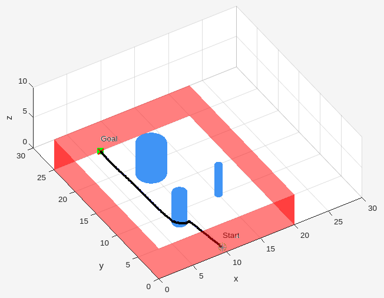

# 3D Artificial Potential Field (APF) Path Planning in MATLAB

This project implements a 3D Artificial Potential Field (APF) algorithm in MATLAB for autonomous path planning and obstacle avoidance. The planner considers various 3D obstacle types and includes safety margins and velocity memory (inertia) to achieve smooth, collision-free navigation.

---

## 🧠 Features

- ✅ 3D APF-based path planning
- 🚧 Obstacle avoidance for:
  - Cylindrical obstacles (e.g., buildings)
  - Spherical obstacles
  - Walls (flat planes)
- 🛡️ Adjustable safety margin around obstacles
- 🔁 Velocity memory for realistic smooth motion
- 📊 Visualization of path and environment in 3D

---

## 🚀 How to Run

1. Open MATLAB and navigate to the project folder.

2. Run the main script:

The script will:
- Generate obstacles
- Compute the path using the APF algorithm
- Display a 3D plot of the environment and planned path

---

## ⚙️ Requirements

- MATLAB R2018 or later (tested on R2021b)
- No toolboxes required beyond standard MATLAB plotting and math functions

---

## 📸 Example Output

---

## 📌 Notes

- The code is **generic** and **not constrained to UAVs**. It can be applied to various autonomous platforms such as:
  - AUVs (Autonomous Underwater Vehicles)
  - UGVs (Unmanned Ground Vehicles)
  - Robotic arms operating in 3D environments
- Safety margins and the inertia (velocity memory) factor can be easily tuned in the `main.m` file.

---

## ✍️ Author

**Mahmoud Yasser**  
Faculty of Engineering, Ain Shams University  
🔗 [GitHub](https://github.com/mahmoudyasser32)
